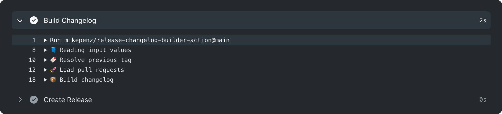
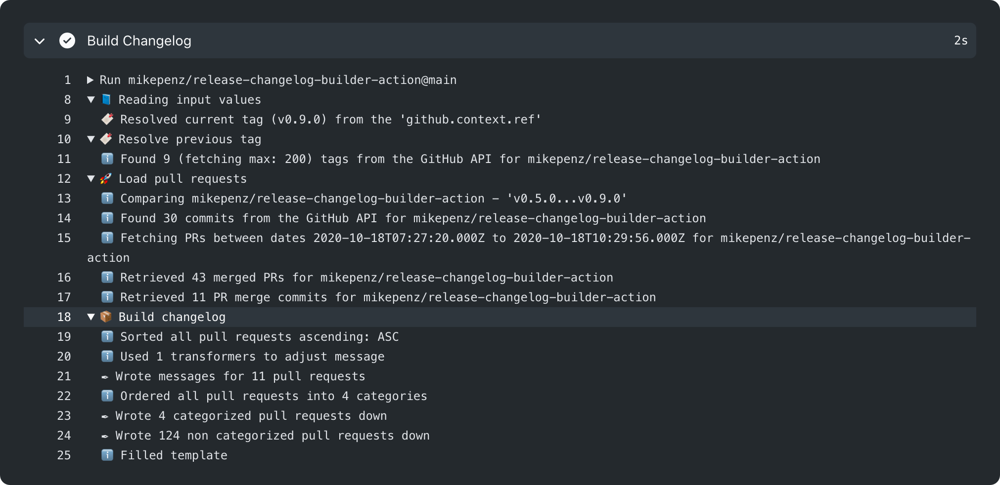
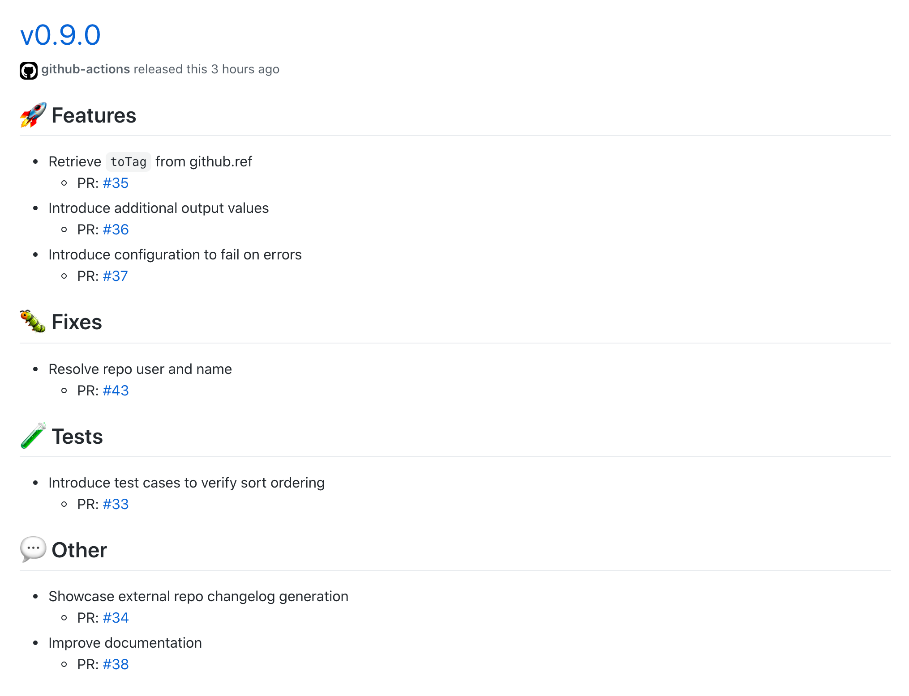

<div align="center">
  :octocat:📄🔖📦
</div>
<h1 align="center">
  release-changelog-builder-action
</h1>

<p align="center">
    ... a GitHub action that builds your release notes / changelog fast, easy and exactly the way you want.
</p>

<div align="center">
  
</div>

<div align="center">
  <a href="https://github.com/mikepenz/release-changelog-builder-action/actions">
		
	</a>
</div>
<br />

-------

<p align="center">
    <a href="#whats-included-">What's included 🚀</a> &bull;
    <a href="#setup">Setup 🛠️</a> &bull;
    <a href="#full-sample-%EF%B8%8F">Sample 🖥️</a> &bull;
    <a href="#customization-%EF%B8%8F">Customization 🖍️</a> &bull;
    <a href="#contribute-">Contribute 🧬</a> &bull;
    <a href="#license">License 📓</a>
</p>

-------

### What's included 🚀

- Super simple integration
  - ...even on huge repositories with hundreds of tags
- Parallel releases support
- Blazingly fast execution
- Supports any git project
- Highly flexible configuration
- Lightweight
- Supports any branch
- Rich build log output

-------

## Setup

### Configure the workflow

Specify the action as part of your GitHub actions workflow:

```yml
- name: "Build Changelog"
  id: build_changelog
  uses: mikepenz/release-changelog-builder-action@{latest-release}
  env:
    GITHUB_TOKEN: ${{ secrets.GITHUB_TOKEN }}
```

### Action outputs

After action execution it will return the `changelog` and additional information as step output. You can use it in any follow-up step by referencing the output by referencing it via the id of the step. For example `build_changelog`.

```yml
# ${{steps.{CHANGELOG_STEP_ID}.outputs.changelog}}
${{steps.build_changelog.outputs.changelog}}
```

A full set list of possible output values for this action.

| **Output**          | **Description**                                                                                                           |
|---------------------|---------------------------------------------------------------------------------------------------------------------------|
| `outputs.changelog` | The built release changelog built from the merged pull requests                                                           |
| `outputs.owner`     | Specifies the owner of the repository processed                                                                           |
| `outputs.repo`      | Describes the repository name, which was processed                                                                        |
| `outputs.fromTag`   | Defines the `fromTag` which describes the lower bound to process pull requests for                                        |
| `outputs.toTag`     | Defines the `toTag` which describes the upper bound to process pull request for                                           |
| `outputs.failed`    | Defines if there was an issue with the action run, and the changelog may not have been generated correctly. [true, false] |


## Full Sample 🖥️

Below is a complete example showcasing how to define a build, which is executed when tagging the project. It consists of:
- Prepare tag, via the GITHUB_REF environment variable
- Build changelog, given the tag
- Create release on GitHub - specifying body with constructed changelog
 
```yml
name: 'CI'
on:
  push:
    tags:
      - '*'

  release:
    if: startsWith(github.ref, 'refs/tags/')
    runs-on: ubuntu-latest
    steps:
      - name: Build Changelog
        id: github_release
        uses: mikepenz/release-changelog-builder-action@main
        env:
          GITHUB_TOKEN: ${{ secrets.GITHUB_TOKEN }}

      - name: Create Release
        uses: actions/create-release@v1
        with:
          tag_name: ${{ github.ref }}
          release_name: ${{ github.ref }}
          body: ${{steps.github_release.outputs.changelog}}
        env:
          GITHUB_TOKEN: ${{ secrets.GITHUB_TOKEN }}
```

## Customization 🖍️

### Configuration

The action supports flexible configuration options to modify vast areas of its behavior. To do so, provide the configuration file to the workflow using the `configuration` setting.

```yml
- name: "Build Changelog"
  uses: mikepenz/release-changelog-builder-action@{latest-release}
  with:
    configuration: "configuration.json"
  env:
    GITHUB_TOKEN: ${{ secrets.GITHUB_TOKEN }}
```

⚠️ When running this action for a non tags trigger the `toTag` can't be automatically resolved, as such it is either required to provide `toTag` directly, or to specify a different `fetch-depth:` with the checkout action to include tags.   

💡 By default not specifying `fromTag` or `toTag` will resolve `toTag` from either the `ref` or alternatively fallback to the latest tag from git. `fromTag` is resolved by sorting tags using [semver](https://semver.org/). Check the [configuration](#configuration-specification) for alternatives.

This configuration is a `.json` file in the following format.

```json
{
    "categories": [
      {
        "title": "## 🚀 Features",
        "labels": ["feature"]
      },
      {
        "title": "## 🐛 Fixes",
        "labels": ["fix"]
      },
      {
        "title": "## 🧪 Tests",
        "labels": ["test"]
      }
    ],
    "ignore_labels": [ 
      "ignore" 
    ],
    "sort": "ASC",
    "template": "${{CHANGELOG}}\n\n<details>\n<summary>Uncategorized</summary>\n\n${{UNCATEGORIZED}}\n</details>",
    "pr_template": "- ${{TITLE}}\n   - PR: #${{NUMBER}}",
    "empty_template": "- no changes",
    "transformers": [
      {
        "pattern": "[\\-\\*] (\\[(...|TEST|CI|SKIP)\\])( )?(.+?)\n(.+?[\\-\\*] )(.+)",
        "target": "- $4\n  - $6"
      }
    ],
    "max_tags_to_fetch": 200,
    "max_pull_requests": 200,
    "max_back_track_time_days": 365,
    "exclude_merge_branches": [
      "Owner/qa"
    ],
    "tag_resolver": {
      "method": "semver"
    }
}
```

Any section of the configuration can be omitted to have defaults apply.

💡 `ignore_labels` take precedence over category labels, allowing to specifically exclude certain PRs.

Defaults for the configuration can be found in the [configuration.ts](https://github.com/mikepenz/release-changelog-builder-action/blob/develop/src/configuration.ts)

Please see the [Configuration Specification](#configuration-specification) for detailed descriptions on the offered configuration options. 

### Advanced workflow specification

For advanced use cases additional settings can be provided to the action

```yml
- name: "Complex Configuration"
  id: build_changelog
  if: startsWith(github.ref, 'refs/tags/')
  uses: mikepenz/release-changelog-builder-action@{latest-release}
  with:
    configuration: "configuration_complex.json"
    owner: "mikepenz"
    repo: "release-changelog-builder-action"
    ignorePreReleases: "false"
    fromTag: "0.3.0"
    toTag: "0.5.0"
    token: ${{ secrets.PAT }}
```

💡 All input values are optional. It is only required to provide the `token` either via the input, or as `env` variable.

| **Input**         | **Description**                                                                                                                                                            |
|-------------------|----------------------------------------------------------------------------------------------------------------------------------------------------------------------------|
| `configuration`     | Relative path, to the `configuration.json` file, providing additional configurations                                                                                     |
| `outputFile`        | Optional relative path to a file to store the resulting changelog in.                                                                                    |
| `owner`             | The owner of the repository to generate the changelog for                                                                                                                |
| `repo`              | Name of the repository we want to process                                                                                                                                |
| `fromTag`           | Defines the 'start' from where the changelog will consider merged pull requests                                                                                          |
| `toTag`             | Defines until which tag the changelog will consider merged pull requests                                                                                                 |
| `path`              | Allows to specify an alternative sub directory, to use as base                                                                                                           |
| `token`             | Alternative config to specify token. You should prefer `env.GITHUB_TOKEN` instead though                                                                                 |
| `ignorePreReleases` | Allows to ignore pre-releases for changelog generation (E.g. for 1.0.1... 1.0.0-rc02 <- ignore, 1.0.0 <- pick). Only used if `fromTag` was not specified. Default: false |
| `failOnError`       | Defines if the action will result in a build failure if problems occurred. Default: false                                                                                |

💡 `${{ secrets.GITHUB_TOKEN }}` only grants rights to the current repository, for other repositories please use a PAT (Personal Access Token).

### PR Template placeholders

Table of supported placeholders allowed to be used in the `pr_template` configuration, which will be included in the release notes / changelog.

| **Placeholder**  | **Description**                                             |
|------------------|-------------------------------------------------------------|
| `${{NUMBER}}`    | The number referencing this pull request. E.g. 13           |
| `${{TITLE}}`     | Specified title of the merged pull request                  |
| `${{URL}}`       | Url linking to the pull request on GitHub                   |
| `${{MERGED_AT}}` | The ISO time, the pull request was merged at                |
| `${{AUTHOR}}`    | Author creating and opening the pull request                |
| `${{LABELS}}`    | The labels associated with this pull request, joined by `,` |
| `${{MILESTONE}}` | Milestone this PR was part of, as assigned on GitHub        |
| `${{BODY}}`      | Description/Body of the pull request as specified on GitHub |
| `${{ASSIGNEES}}` | Login names of assigned GitHub users, joined by `,`         |
| `${{REVIEWERS}}` | GitHub Login names of specified reviewers, joined by `,`    |

### Template placeholders

Table of supported placeholders allowed to be used in the `template` and `empty_template` (only supports placeholder marked for empty) configuration, to give additional control on defining the contents of the release notes / changelog. 

| **Placeholder**            | **Description**                                                                                    | **Empty** |
|----------------------------|----------------------------------------------------------------------------------------------------|:---------:|
| `${{CHANGELOG}}`           | The contents of the changelog, matching the labels as specified in the categories configuration    |           |
| `${{UNCATEGORIZED}}`       | All pull requests not matching a specified label in categories                                     |           |
| `${{IGNORED}}`             | All pull requests defining labels matching the `ignore_labels` configuration                       |           |
| `${{OWNER}}`               | Describes the owner of the repository the changelog was generated for                              | x         |
| `${{REPO}}`                | The repository name of the repo the changelog was generated for                                    | x         |
| `${{FROM_TAG}}`            | Defines the 'start' from where the changelog did consider merged pull requests                     | x         |
| `${{TO_TAG}}`              | Defines until which tag the changelog did consider merged pull requests                            | x         |
| `${{CATEGORIZED_COUNT}}`   | The count of PRs which were categorized                                                            |           |
| `${{UNCATEGORIZED_COUNT}}` | The count of PRs and changes which were not categorized. No label overlapping with category labels |           |
| `${{IGNORED_COUNT}}`       | The count of PRs and changes which were specifically ignored from the changelog.                   |           |


### Configuration Specification

Table of descriptions for the `configuration.json` options to configure the resulting release notes / changelog.

| **Input**                | **Description**                                                                                                                                                                                                                    |
|--------------------------|------------------------------------------------------------------------------------------------------------------------------------------------------------------------------------------------------------------------------------|
| categories               | An array of `category` specifications, offering a flexible way to group changes into categories                                                                                                                                    |
| category.title           | The display name of a category in the changelog                                                                                                                                                                                    |
| category.labels          | An array of labels, to match pull request labels against. If any PR label matches any category label, the pull request will show up under this category                                                                            |
| ignore_labels            | An array of labels, to match pull request labels against. If any PR label overlaps, the pull request will be ignored from the changelog. This takes precedence over category labels                                                |
| sort                     | The sort order of pull requests. [ASC, DESC]                                                                                                                                                                                       |
| template                 | Specifies the global template to pick for creating the changelog. See [Template placeholders](#template-placeholders) for possible values                                                                                          |
| pr_template              | Defines the per pull request template. See [PR Template placeholders](#pr-template-placeholders) for possible values                                                                                                               |
| empty_template           | Template to pick if no changes are detected. See [Template placeholders](#template-placeholders) for possible values                                                                                                               |
| transformers             | An array of `transform` specifications, offering a flexible API to modify the text per pull request. This is applied on the change text created with `pr_template`. `transformers` are executed per change, in the order specified |
| transformer.pattern      | A `regex` pattern, extracting values of the change message.                                                                                                                                                                        |
| transformer.target       | The result pattern, the regex groups will be filled into. Allows for full transformation of a pull request message. Including potentially specified texts                                                                          |
| max_tags_to_fetch        | The maximum amount of tags to load from the API to find the previous tag. Loaded paginated with 100 per page                                                                                                                       |
| max_pull_requests        | The maximum amount of pull requests to load from the API. Loaded paginated with 30 per page                                                                                                                                        |
| max_back_track_time_days | Defines the max amount of days to go back in time per changelog                                                                                                                                                                    |
| exclude_merge_branches   | An array of branches to be ignored from processing as merge commits                                                                                                                                                                |
| tag_resolver             | Section to provide configuration for the tag resolving logic. Used if no `fromTag` is provided                                                                                                                                     |
| tag_resolver.method      | Defines the method to use. Current options are: `semver`, `sort`. Default: `semver`                                                                                                                                                |

## Contribute 🧬

```bash
# Install the dependencies  
$ npm install

# Build the typescript and package it for distribution
$ npm run build && npm run package

# Run the tests, use to debug, and test it out
$ npm test

# Verify lint is happy
$ npm run lint -- --fix
```

It's suggested to export the token to your path before running the tests so that API calls can be done to GitHub.

```bash
export GITHUB_TOKEN=your_personal_github_pat
```

## Developed By

* Mike Penz
 * [mikepenz.com](http://mikepenz.com) - <mikepenz@gmail.com>
 * [paypal.me/mikepenz](http://paypal.me/mikepenz)

## Credits

- Core parts of the PR fetching logic are based on [pull-release-notes](https://github.com/nblagoev/pull-release-notes)
  - Nikolay Blagoev - [GitHub](https://github.com/nblagoev/)
- [action-gh-release](https://github.com/softprops/action-gh-release) for a few great README ideas

## Other actions

- [xray-action](https://github.com/mikepenz/xray-action/)
- [action-junit-report](https://github.com/mikepenz/action-junit-report)
- [jira-release-composition-action](https://github.com/mikepenz/jira-release-composite-action)

## License

    Copyright for portions of pr-release-notes are held by Nikolay Blagoev, 2019-2020 as part of project pull-release-notes. 
    All other copyright for project pr-release-notes are held by Mike Penz, 2021.

## Fork License

All patches and changes applied to the original source are licensed under the Apache 2.0 license.

    Copyright 2021 Mike Penz

    Licensed under the Apache License, Version 2.0 (the "License");
    you may not use this file except in compliance with the License.
    You may obtain a copy of the License at

       http://www.apache.org/licenses/LICENSE-2.0

    Unless required by applicable law or agreed to in writing, software
    distributed under the License is distributed on an "AS IS" BASIS,
    WITHOUT WARRANTIES OR CONDITIONS OF ANY KIND, either express or implied.
    See the License for the specific language governing permissions and
    limitations under the License.

## Sample result release notes / changelog

<div align="center">
  <a href="https://github.com/mikepenz/release-changelog-builder-action/runs/1270879787"></a>
</div>

<div align="center">
  <a href="https://github.com/mikepenz/release-changelog-builder-action/releases/tag/v0.9.0"></a>
</div>
